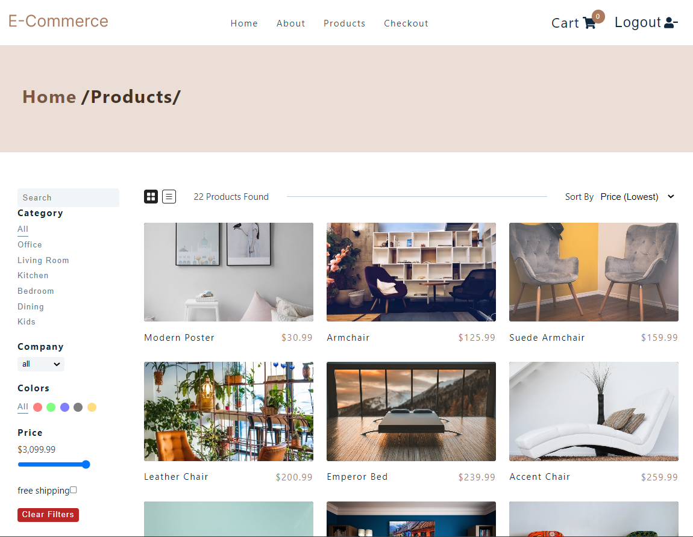

# Ecommerce-react.js

## Table of Contents
* [Overview](#overview)
* [Project Screenshot](#screenshots)
* [Installation](#installation)
* [References](#references)
* [Author](#author)

# Overview
An e-commerce project built in React.js frontend only would likely consist of a web application that allows users to browse and purchase products online. The application would use React.js to create a dynamic, interactive user interface that allows users to search for products, add them to a shopping cart, and checkout.

The frontend of the application would be responsible for rendering the user interface, handling user interactions, and communicating with the backend API to retrieve and update product data, user data, and order data.

Some of the key features that could be included in an e-commerce project built in React.js frontend only are:

Product catalog: A searchable and filterable catalog of products, with images, descriptions, and pricing information.

Product pages: Pages for individual products, displaying more detailed information about the product and allowing users to add it to their cart.

Shopping cart: A page that displays the items currently in the user's cart, with options to edit quantities or remove items.

Checkout: A process that guides the user through the steps required to complete a purchase, including entering shipping and payment information.

User account: A page where users can view their order history, update their account information, and manage their saved addresses and payment methods.

Authentication and authorization: A system for registering new users, logging in existing users, and protecting sensitive user data with appropriate security measures.

Responsive design: A layout that adapts to different screen sizes, making the application accessible and easy to use on desktop and mobile devices.

Overall, an e-commerce project built in React.js frontend only would require a thorough understanding of React.js and its ecosystem of tools and libraries, as well as knowledge of web development best practices, including accessibility, security, and performance optimization.

## Screenshots
 

### You can watch Live demo [_here_](https://ecommerce1001.netlify.app/).

## Installation

Clone down this repository. You will need `node` and `npm` installed globally on your machine.  

Installation:

`npm install`  

To Start Server:

`npm start`  

To Visit App:

`localhost:3000`  

## References
- [TailwindCSS](https://tailwindcss.com/)
- [React](https://reactjs.org/docs/getting-started.html)

## Author

[Website](https://kedarmakode.com/)

[Linkedin](https://www.linkedin.com/in/kedar-makode-9833321ab)

[Twitter](https://twitter.com/Kedar__98)

kedarmakode1598@gmail.com

